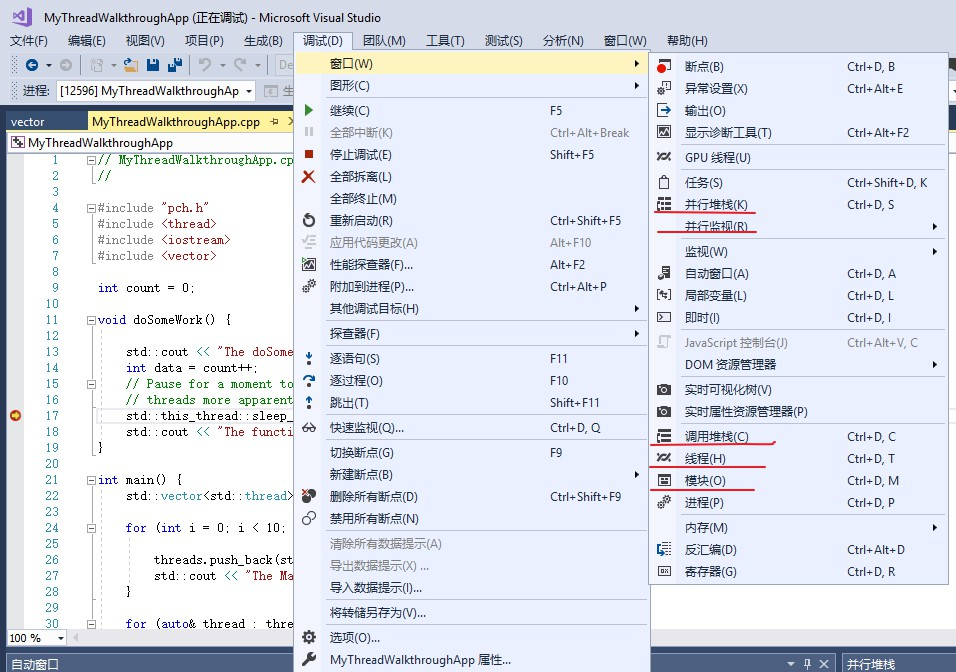

# 1. Algorithm


#####  Two Sum

1. 方法一：双层循环暴力求解——时间复杂度O(n*n)

   ```c++
   class Solution {
   public:
    vector<int> twoSum(vector<int>& nums, int target) {
        int size = nums.size();
        vector<int> result;
        for (int i=0; i<size-1; i++)
        {
            for(int j=i+1;j<size;j++)
            {
                if ((nums[i]+nums[j]) == target)
                {
                    result.push_back(i);
                    result.push_back(j);
                    return result;
                }
            }
        }
        return result;
    }
   };
   ```

   

2. 方法二：哈希表查找——时间复杂度O(n)，空间复杂度(n)

   ​	意图：使用哈希表，牺牲存储空间来，降低查询所需的时间。在数组数量及其庞大时效果最佳。

   ​	思路：（1）将输入的数组装换为哈希表（map），key为数组值，value为index。（2）在得到初始化后的哈希表后，进行遍历，通过如下公式，计算得到期望的差值。（3）将差值代入map中进行查找，若有，则返回，否则重复步骤（2）。

   ```c++
   int desiredResult=target-map[key];
   ```

   [Google工程师关于此问题的讨论过程——Youtube](<https://www.youtube.com/watch?v=XKu_SEDAykw>)


# 2. Review

阅读文章：[The Key To Accelerating Your Coding Skills](http://blog.thefirehoseproject.com/posts/learn-to-code-and-be-self-reliant)

​	近期也刚好把MIT公开课的《计算机科学与编程导论》看完了，开始在做编程作业。感觉课程和这篇文章讲述的内容很相似。要想自身的相关技能有一个突破或者飞跃，前期的准备和磨砺是必不可少的，如文中提到的算法、数据结构。以前我关注的点实在是太小太小了，小到“只见树木不见森林”。

​	再有一点是技术栈的更新，如今新技术层出不穷，常年苦追，什么时候才是尽头？为何不尝试停下来仔细去思考一番，了解新旧技术背后的本质，这个才是最重要的。保持日常充沛的精力，继续前进吧！


# 3. Tips

因为在日常中需接触C++的多线程调试，但苦于不知道调试方法，遂去官网查看并学习了VS2017的多线程调试方式。

其中主要介绍内容如下：

1. 并行堆栈
2. 并行监视
   1. 线程的冻结、解冻
   2. 标记
   3. 添加数据监视
3. 模块
   1. pdb文件（Symbol file）
   2. 模块符号导入
   3. 源代码（或反汇编代码）的定位
4. 线程
   1. 当前应用的线程


**相关学习资源：**

1. [Debug multithreaded applications in Visual Studio](https://docs.microsoft.com/en-us/visualstudio/debugger/debug-multithreaded-applications-in-visual-studio?view=vs-2017)

2. Demo视频：[Debugging multithread apps demo](https://www.youtube.com/watch?v=ISDaHM1cHXk)

**附图：**




# 4. Share

开始看《算法图解》这本书，弥补日前算法这块的空缺。主要学习了数组和链表各自的优势劣势，详细内容见我的CSDN博客：[数组与链表——异同分析](https://blog.csdn.net/VVBBBBB/article/details/89036793) 