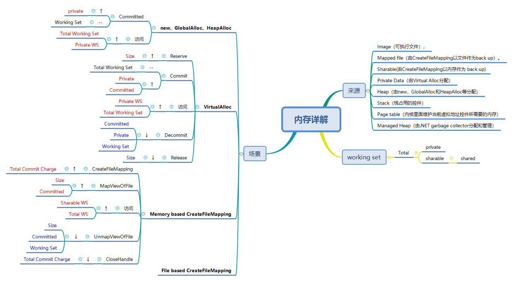

# 1. Algorithm

[100. Same Tree](<https://leetcode.com/problems/same-tree/>)

卡了很久，第一件想到的就是递归——问题的分治解法

还有一种是在数组中还原出树的结构，再进行比较。

# 2. Review

[The Best Reason for Your City to Ban Facial Recognition](<https://onezero.medium.com/the-best-reason-for-your-city-to-ban-facial-recognition-d2c1f9ca094b?JGa=true>)

​	昨天看到了一则新闻，说美国有个政府将不在内部使用人脸识别技术。Medium中本文的作者对此也进行了分析，主要的立场是从自由、准确性来说，也是相当有说服力的。

​	在个人看来，人脸识别技术（或相关的这类技术）的出现和发展确实解决的很多现今存在的问题。解决旧问题，很多时候又会出现新问题，就是文中作者提到的准确率——Mismatch，这个完全是不可避免的。和工业级的产品不同，这个在大量人群中能更高效的捞出某几个人，其实有极大的价值——极大的解放了人力——换做你，让你天天盯着屏幕去找目标人物，累不累！

​	于此同时，法律很多时候也都是滞后于技术的发展，这块其实也会慢慢补上，不会有太大的问题。

# 3. Tips

#### Windows内存相关概念

内存

一个32位应用程序，可以占用的内存大小为4GB（2^32），而用户可用的内存大小为2GB，其余主要由系统内核占有，当然也有空指针区、64KB禁入分区。若感觉用户模式分区的2G太小，可以运行BCDEdit.exe调整至3GB。

两个概念：Working Set（工作集）、Virtual Bytes（虚拟内存）

这个和操作系统特性有关，在不同情况下，软件的在物理内存中的状态会发生变化。其具体变化方式可以通过VMMap软件进行监控得到。

**具体关系可以如下表示：**

1. Virtual Bytes = Page File + Physical Memory
2. Working Set，即Total Work Set，由private work set和sharable work set组成

Working Set的变化，主要集中在对物理内存的操控和撤销。

Virtual Bytes主要是软件整体中，对内存的使用（分页文件+物理内存）

# 4. Share

无